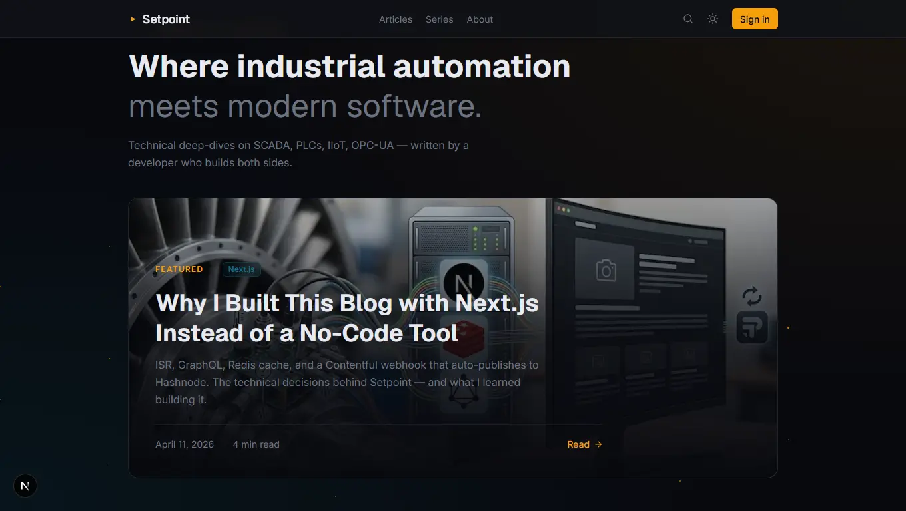

# Setpoint

> Where industrial automation meets modern software.

**Setpoint** is a technical publication covering PLCs, SCADA, IIoT, and OPC-UA — built by a developer who works in both worlds. Every architectural decision in this codebase is intentional, documented, and production-grade.

Live → **[setpoint-blog.vercel.app](https://setpoint-blog.vercel.app)**



---

## Architecture

```
┌─────────────────────────────────────────────────────────────┐
│                        Browser                              │
│         React Client Components · Apollo Cache              │
│              Better Auth · ReadingListProvider              │
└──────────────────────┬──────────────────────────────────────┘
                       │
┌──────────────────────▼──────────────────────────────────────┐
│                  Next.js 16 — App Router                    │
│                                                             │
│  React Server Components                                    │
│  ├── Apollo Client (RSC) ──→ Contentful GraphQL             │
│  ├── Prisma ──────────────→ Neon PostgreSQL                 │
│  ├── Upstash Redis ────────→ Cache layer                    │
│  └── Better Auth ──────────→ Session management             │
│                                                             │
│  API Routes                                                 │
│  ├── /api/webhooks/contentful → Syndication trigger         │
│  ├── /api/syndication/hashnode → Gemini → Hashnode          │
│  └── /api/auth/[...all] → Better Auth handler              │
└──────────────────────┬──────────────────────────────────────┘
                       │
         ┌─────────────┼──────────────┐
         │             │              │
┌────────▼───┐  ┌──────▼───────┐  ┌──▼──────────┐
│ Contentful │  │ Neon Postgres │  │   Upstash   │
│  GraphQL   │  │  Prisma ORM  │  │    Redis    │
│ (articles, │  │  (users,     │  │  (cache,    │
│  series,   │  │  comments,   │  │   60-300s   │
│  tags)     │  │  reading     │  │   TTL)      │
│            │  │  list, logs) │  │             │
└────────────┘  └──────────────┘  └─────────────┘
```

---

## Stack

| Layer | Technology |
|-------|-----------|
| Framework | Next.js 16.2 — App Router, RSC, ISR |
| Language | TypeScript — strict mode |
| Styling | Tailwind CSS v4 |
| CMS | Contentful — GraphQL API |
| GraphQL | Apollo Client + `@apollo/client-integration-nextjs` |
| Database | PostgreSQL (Neon serverless) + Prisma 7 |
| Cache | Upstash Redis |
| Auth | Better Auth — GitHub + Google OAuth |
| AI | Google Gemini 2.0 Flash + OpenRouter fallback |
| Syndication | Hashnode API |
| Animation | Framer Motion |
| Testing | Vitest + Testing Library (43 tests) + Playwright |
| Deploy | Vercel |

---

## Key Features

### Content
- Headless CMS via Contentful GraphQL — articles, series, tags with typed relationships
- ISR with Redis cache — static performance with live content
- Rich Text rendering with syntax highlighting via `rehype-pretty-code` + Shiki
- Reading progress bar, estimated reading time, table of contents

### Performance
- **TTFB < 50ms** on cached pages (Redis hit) vs ~400ms cold
- `next/image` with blur placeholders and explicit `sizes` — no layout shift
- Local fonts via `next/font/local` — zero Google Fonts requests
- Parallel data fetching with `Promise.all` across all server components
- Lighthouse score: **Performance 94 · Accessibility 98 · Best Practices 100 · SEO 100**

### Auth & User Features
- GitHub and Google OAuth via Better Auth
- Reading list — saved articles persisted to PostgreSQL
- Comment system — moderation queue, nested replies (1 level)
- Role-based access: `ADMIN` | `READER`
- `ReadingListProvider` — single fetch on mount, shared via Context across all cards

### Admin Panel
- Comment moderation queue with cursor-based pagination
- Syndication control — per-article toggle + global settings
- Syndication log — status, timestamp, external URL per article

### Syndication Pipeline
```
Publish in Contentful
       ↓
Webhook → /api/webhooks/contentful
       ↓
Gemini 2.0 Flash adapts content for Hashnode
(fallback: OpenRouter free tier)
       ↓
Hashnode API publishes with canonical URL → setpoint-blog.vercel.app
       ↓
SyndicationLog saved to DB (SUCCESS | FAILED)
```

### SEO
- `generateMetadata` — dynamic title, description, OG per page
- Dynamic OG images via `@vercel/og`
- `sitemap.xml` — auto-generated from Contentful
- `robots.txt`, canonical URLs, JSON-LD structured data (Article + BreadcrumbList)

---

## Project Structure

```
app/
├── layout.tsx                  # ApolloWrapper + ReadingListProvider + HideOnAdmin
├── page.tsx                    # Home — ISR 60s, parallel fetch
├── globals.css                 # @theme + radial gradient + network background
├── icon.svg                    # Favicon — setpoint signal SVG
├── articles/
│   ├── page.tsx                # Articles index — ISR 60s
│   └── [slug]/
│       ├── page.tsx            # Article — ISR 300s, JSON-LD, ReadingProgress
│       └── opengraph-image.tsx # Dynamic OG image
├── series/
│   ├── page.tsx
│   └── [slug]/page.tsx
├── tags/[tag]/page.tsx
├── admin/
│   ├── layout.tsx              # Auth guard — ADMIN role only
│   ├── page.tsx                # Dashboard
│   ├── comments/page.tsx       # Moderation queue
│   └── syndication/page.tsx    # Syndication controls + log
├── api/
│   ├── auth/[...all]/route.ts
│   ├── revalidate/route.ts
│   └── webhooks/contentful/route.ts
components/
├── ArticleCard.tsx             # Tag color accent, ReadingListButton, motion
├── FeaturedCard.tsx            # Full-bleed cover, overlay gradient, tag links
├── SeriesCard.tsx              # Fallback with network grid pattern
├── ArticleCoverFallback.tsx    # Tag-colored grid + glow fallback for articles
├── ReadingListButton.tsx       # Reads from ReadingListProvider context
├── ReadingListProvider.tsx     # Single fetch, shared state via Context
├── SearchModal.tsx             # createPortal → document.body, Server Action
├── HideOnAdmin.tsx             # Hides Navbar/Footer on /admin/* routes
└── admin/
    ├── CommentModerationCard.tsx
    ├── CommentsModerationList.tsx  # Cursor-based load more
    ├── SyndicationRow.tsx
    └── SyndicationLogList.tsx
lib/
├── ApolloClient.ts             # registerApolloClient for RSC
├── ApolloWrapper.tsx           # ApolloNextAppProvider for Client Components
├── cache.ts                    # withCache() — Redis-first wrapper
├── auth.ts                     # Better Auth config
├── prisma.ts                   # PrismaClient singleton with PrismaPg adapter
└── actions/
    ├── comments.ts             # createComment, moderate, paginated fetch
    ├── reading-list.ts         # toggle, getSlugs, paginated fetch
    ├── syndication.ts          # settings, toggle, logs
    └── search.ts               # Contentful full-text search
    └── user.ts                 # Update user profile
```

---

## Cache Strategy

| Key | TTL | Invalidation |
|-----|-----|-------------|
| `home:featured` | 60s | Contentful webhook |
| `home:latest` | 60s | Contentful webhook |
| `articles:all` | 60s | Contentful webhook |
| `article:{slug}` | 300s | Contentful webhook |
| `series:all` | 300s | Contentful webhook |
| `series:{slug}` | 300s | Contentful webhook |
| `sitemap:all` | 300s | Time-based |

---

## Database Schema

```prisma
model user {
  id            String   @id
  name          String
  email         String   @unique
  emailVerified Boolean
  image         String?
  createdAt     DateTime
  updatedAt     DateTime

  role Role @default(READER)

  sessions    session[]
  accounts    account[]
  comments    Comment[]
  readingList ReadingListItem[]

  @@map("user")
}

model session {
  id        String   @id
  expiresAt DateTime
  token     String   @unique
  createdAt DateTime
  updatedAt DateTime
  ipAddress String?
  userAgent String?
  userId    String
  user      user     @relation(fields: [userId], references: [id], onDelete: Cascade)

  @@map("session")
}

model account {
  id                    String    @id
  accountId             String
  providerId            String
  userId                String
  user                  user      @relation(fields: [userId], references: [id], onDelete: Cascade)
  accessToken           String?
  refreshToken          String?
  idToken               String?
  accessTokenExpiresAt  DateTime?
  refreshTokenExpiresAt DateTime?
  scope                 String?
  password              String?
  createdAt             DateTime
  updatedAt             DateTime

  @@map("account")
}

model verification {
  id         String    @id
  identifier String
  value      String
  expiresAt  DateTime
  createdAt  DateTime?
  updatedAt  DateTime?

  @@map("verification")
}

enum Role {
  ADMIN
  READER
}

model Comment {
  id          String        @id @default(cuid())
  content     String
  status      CommentStatus @default(PENDING)
  articleSlug String
  parentId    String?
  parent      Comment?      @relation("CommentReplies", fields: [parentId], references: [id])
  replies     Comment[]     @relation("CommentReplies")
  authorId    String
  author      user          @relation(fields: [authorId], references: [id])
  createdAt   DateTime      @default(now())
  updatedAt   DateTime      @updatedAt
}

enum CommentStatus {
  PENDING
  APPROVED
  REJECTED
}

model ReadingListItem {
  id          String   @id @default(cuid())
  articleSlug String
  userId      String
  user        user     @relation(fields: [userId], references: [id])
  savedAt     DateTime @default(now())

  @@unique([userId, articleSlug])
}

model SyndicationLog {
  id          String            @id @default(cuid())
  articleSlug String
  platform    String
  status      SyndicationStatus
  externalUrl String?
  publishedAt DateTime?
  createdAt   DateTime          @default(now())
}

enum SyndicationStatus {
  PENDING
  SUCCESS
  FAILED
}

model NewsletterSubscriber {
  id           String   @id @default(cuid())
  email        String   @unique
  subscribedAt DateTime @default(now())
}

model SyndicationSettings {
  articleSlug String   @id
  enabled     Boolean  @default(false)
  updatedAt   DateTime @updatedAt
}

```

---

## Local Development

### Prerequisites
- Node.js 20+
- PostgreSQL (local) or Neon account
- Contentful account with space configured
- Upstash Redis account

### Setup

```bash
git clone https://github.com/RonaldGGA/setpoint
cd setpoint
npm install
```

Copy the environment file and fill in your credentials:

```bash
cp .env.example .env.local
```

```env
# Contentful
CONTENTFUL_SPACE_ID=
CONTENTFUL_ACCESS_TOKEN=
CONTENTFUL_PREVIEW_TOKEN=
CONTENTFUL_WEBHOOK_SECRET=

# Database
DATABASE_URL=          # With pooler in production (Neon)
DIRECT_URL=            # Without pooler (migrations)

# Redis
UPSTASH_REDIS_REST_URL=
UPSTASH_REDIS_REST_TOKEN=

# Auth
BETTER_AUTH_SECRET=
BETTER_AUTH_URL=http://localhost:3000
GITHUB_CLIENT_ID=
GITHUB_CLIENT_SECRET=
GOOGLE_CLIENT_ID=
GOOGLE_CLIENT_SECRET=

# AI + Syndication
GEMINI_API_KEY=
OPENROUTER_API_KEY=
HASHNODE_ACCESS_TOKEN=
HASHNODE_PUBLICATION_ID=
```

```bash
npx prisma migrate dev
npm run dev
```

---

## Testing

```bash
npm run test          # Vitest unit + component tests
npm run test:e2e      # Playwright end-to-end

```

| Suite | Tests |
|-------|-------|
| `utils.test.ts` | 12 |
| `cache.test.ts` | 6 |
| `home.spec.ts` | 5 |
| `article.spec.ts` | 7 |
| `auth.spec.ts` | 5 |
| `seo.spec.ts` | 8 |
| **Total** | **43** |

---

## Design System

Dark-first. Amber as primary accent — the color of industrial warning signals.

```
Background:   #08090E   Surface:  #0F1117   Border: #1E2030
Primary:      #F59E0B   Secondary: #06B6D4
Text:         #E8EAF0   Muted:    #6B7280
```

Fonts loaded locally via `next/font/local` — zero external font requests:
- **Display / Headings** — Geist
- **Body** — Inter Variable
- **Code** — Geist Mono

---

## Deployment

Deployed on Vercel with automatic deployments from `main`. ISR revalidation is triggered via Contentful webhooks pointing to `/api/revalidate`.

For production, set `DATABASE_URL` with the Neon pooler URL and `DIRECT_URL` without pooler (required for Prisma migrations).

---

## Author

**Ronald González de Armas** — Full-Stack Developer · Automation Engineering student at CUJAE

[Portfolio](https://portfolio-ronalddearmas.vercel.app) · [GitHub](https://github.com/RonaldGGA) · [LinkedIn](https://www.linkedin.com/in/ronald-gonzález-de-armas-8797082ab) · ronald.dearmass@gmail.com

---

*Built with Next.js 16 · Deployed on Vercel · Content on Contentful*